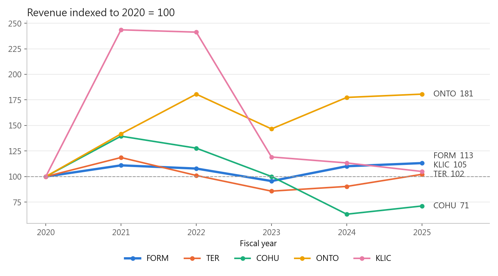
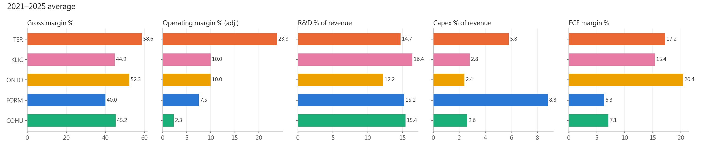

# FormFactor (NASDAQ: FORM) Investment Analysis

An end-to-end equity research project on **FormFactor**, a U.S. leader in semiconductor wafer probe cards, built as a hands-on exercise in financial data engineering and analysis: pulling raw filings from the SEC, cleaning them, modeling them in SQL, and turning the numbers into an investment view.

> Notebooks are written with explanations in Traditional Chinese; code, SQL, and charts are in English.

**Author:** Chen-Chih (Cosby) Hung — MS in Business Analytics candidate, University of Illinois Urbana-Champaign

---

## What this project demonstrates

| Area | Skills |
|---|---|
| Data extraction | SEC EDGAR XBRL API (`companyfacts`), `requests`, JSON parsing, caching |
| Data cleaning | 10-K filtering, 52/53-week fiscal year alignment, restatement handling, de-duplication, tag fallbacks |
| Data modeling | SQLite star schema (fact + dimension tables), primary keys, views, idempotent loads |
| SQL | `CASE WHEN` pivots, window functions (`LAG`, `ROW_NUMBER`, `RANK`, `FIRST_VALUE`, `SUM() OVER`), CTEs, self-joins, multi-key joins, `UNION ALL` |
| Python | pandas, reusable ETL module (`sec_etl.py`), matplotlib |
| Financial analysis | Margin, return, liquidity and cash-flow ratios; one-time item adjustment; CAGR; peer benchmarking; FX conversion; market share and HHI |

## Pipeline

```
SEC EDGAR API ──► raw JSON ──► clean long table ──► CSV ──► SQLite ──► SQL views ──► ratios, peer & market analysis ──► charts
                                                         ▲
                          manually collected research data (10-K, earnings releases, FX rates) with source column
```

## Repository structure

```
├── 01_extract_clean.ipynb      Step 1  Pull FormFactor XBRL data from SEC, clean, export CSV
├── 02_sql_analysis.ipynb       Step 2  Load into SQLite, compute financial ratios with SQL
├── 03_peer_comparison.ipynb    Step 3a Peer benchmarking vs Teradyne, Cohu, Onto Innovation, Kulicke & Soffa
├── 04_market_structure.ipynb   Step 3b Revenue mix, probe-card market share, customers, supply chain
├── sec_etl.py                  Reusable ETL functions (fetch → flatten → clean → map → derive)
├── data/
│   ├── clean/                  Cleaned financial statements (long and wide CSV)
│   ├── research/               Manually collected market data, every row with its source
│   └── analysis/               Output tables and charts
└── requirements.txt
```

## How to run

```bash
pip install -r requirements.txt
jupyter notebook
```

Run the notebooks in order (01 → 04). The SEC requires a `User-Agent` header with your name and email; set it in the `HEADERS` line of notebooks 01 and 03. Raw SEC responses are cached in `data/raw/` and the SQLite database is rebuilt by the notebooks, so neither is committed.

## Key findings

**1. Revenue is the most stable in its peer group, but profitability lags.**
FormFactor's revenue grew from $589.5M (2019) to $785.0M (2025). In the 2023 downturn its revenue fell 11.3%, the smallest decline among five U.S.-listed test and packaging peers (Teradyne −15.2%, Onto −18.8%, Cohu −21.7%, Kulicke & Soffa −50.6%).

**2. A reported profit jump in 2023 was a one-time gain.**
GAAP net income rose 62% in 2023 while revenue fell 11%. The gap was a $73.0M gain on the sale of the FRT business; excluding it, operating income fell from $54.9M to about $9.8M.

**3. Low gross margin and heavy capex, not R&D, drive the weak free cash flow.**
2021–2025 averages versus peers:

| | Gross margin | Operating margin (adj.) | R&D % rev | Capex % rev | FCF margin |
|---|---|---|---|---|---|
| Teradyne | 58.6% | 23.8% | 14.7% | 5.8% | 17.2% |
| Onto Innovation | 52.3% | 10.0% | 12.2% | 2.4% | 20.4% |
| Kulicke & Soffa | 44.9% | 10.0% | 16.4% | 2.8% | 15.4% |
| Cohu | 45.2% | 2.3% | 15.4% | 2.6% | 7.1% |
| **FormFactor** | **40.0%** | **7.5%** | **15.2%** | **8.8%** | **6.3%** |

**4. FormFactor is losing share to direct probe-card competitors, who are also more profitable.**
Converted to USD, Technoprobe's 2025 revenue ($709M) exceeded FormFactor's probe-card segment ($638M). In 2025 FormFactor's probe-card revenue grew 1.9% versus 16% (Technoprobe), 26% (Micronics Japan) and 33% (Chunghwa Precision Test) in local currency. Technoprobe and Micronics Japan earned 16–17% net margins versus 6.9% at FormFactor, so the low margin is company-specific rather than structural to the industry.

**5. DRAM / HBM is becoming the growth engine.**
DRAM rose from 29.8% of revenue in 2024 to 34.3% in the twelve months to June 2026, and SK hynix became the largest customer (about 22.9% of 2025 revenue).

<p align="center">
  
  
</p>

## Data sources

- SEC EDGAR XBRL `companyfacts` API — FormFactor, Teradyne, Cohu, Onto Innovation, Kulicke & Soffa
- FormFactor 10-K (FY2025), 10-Q (six months ended July 1, 2023) and Q4 2023 / Q4 2025 earnings releases
- Technoprobe FY2025 results release; Micronics Japan FY2025 consolidated results; Chunghwa Precision Test 2025 revenue (Economic Daily News)
- IRS yearly average currency exchange rates
- Mordor Intelligence probe card market report (market size estimate)

## Limitations

- Peer revenue scopes differ: FormFactor's probe-card figure excludes its Systems segment, while competitors' figures are total company revenue (Technoprobe includes the Device Interface Solutions business acquired from Teradyne).
- Kulicke & Soffa's fiscal year ends in September/October, about one quarter offset from the other companies.
- Onto Innovation was formed by a merger in October 2019, which inflates growth measured from a 2019 base.
- The total probe-card market size is a third-party estimate; estimates vary by provider.

## Next steps

- Technology analysis: MEMS and vertical probe roadmaps, HBM and advanced-packaging test challenges, co-packaged optics testing
- Integrated investment report with recommendation
